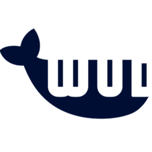

# What's up Docker?

#### [:blue_book: User documentation](https://fmartinou.github.io/whats-up-docker/)

### What's up Docker? <small>(aka **WUD**)</small>
Gets you notified when new versions of your Docker containers are available and lets you react the way you want.

### WUD is built on 3 concepts:

> `WATCHERS` query your Docker hosts to get the containers to watch

> `REGISTRIES` query the Docker registries to find available updates

> `TRIGGERS` perform actions when updates are available

## Many supported triggers
> Send notifications using **Smtp**, [**Apprise**](https://github.com/caronc/apprise-api), [**Ifttt**](https://ifttt.com), [**Pushover**](https://pushover.net), [**Slack**](https://slack.com), [**Telegram**](https://telegram.org/), [**Discord**](https://discord.com/)...

> Automatically update your [**docker**](https://www.docker.com) containers or your [**docker-compose**](https://docs.docker.com/compose) stack.

> Integrate with third-party systems using [**Kafka**](https://kafka.apache.org), [**Mqtt**](https://mqtt.org), **Http Webhooks**...

> Setup your own update strategies \
> (e.g. automatically update containers when minor or patch versions are available & notify by email when major versions are available)

## Many supported registries

> [**AWS Elastic Container Registry**](https://aws.amazon.com/ecr)

> [**Azure Container Registry**](https://azure.microsoft.com/services/container-registry)

> [**Docker Hub**](http://hub.docker.com)

> [**Github Container Registry**](https://docs.github.com/en/packages/working-with-a-github-packages-registry/working-with-the-docker-registry)

> [**Gitlab Container Registry**](https://docs.gitlab.com/ee/user/packages/container_registry/)

> [**Google Container Registry**](https://cloud.google.com/container-registry)

> [**Hotio**](https://hotio.dev)

> [**LinuxServer Container Registry (lscr.io)**](https://fleet.linuxserver.io/)

> [**Redhat Quay**](https://quay.io/)

> [**Self-hosted Docker Registry**](https://docs.docker.com/registry/)

## REST API & Web UI

## Flexible authentication strategies
- [Openid Connect](https://openid.net/connect/)
- [Basic authentication](https://developer.mozilla.org/en-US/docs/Web/HTTP/Authentication)

## Good integration with

> [**Authelia**](https://www.authelia.com/)

> [**Authentik**](https://goauthentik.io/)

> [**Grafana**](https://grafana.com/)

> [**Home-Assistant**](https://www.home-assistant.io/)

> [**Keycloak**](https://www.keycloak.org/)

> [**Prometheus**](https://prometheus.io/)

> ...

## Ready to go?
> **Check out the [documentation](https://fmartinou.github.io/whats-up-docker/) to get started!**

## Contact & Support
- Create a [GitHub issue](https://github.com/fmartinou/whats-up-docker/issues) for bug reports, feature requests, or questions
- Add a ⭐️ [star on GitHub](https://github.com/fmartinou/whats-up-docker) or [Buy me coffee](https://www.buymeacoffee.com/61rUNMm)&nbsp;to support the project!

## License
This project is licensed under the [MIT license](https://github.com/fmartinou/whats-up-docker/blob/master/LICENSE).
