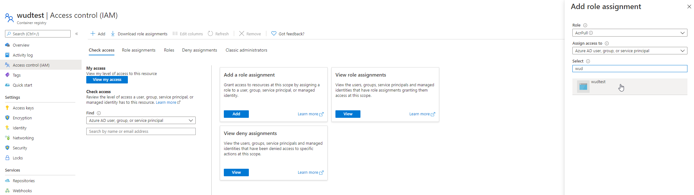

### ACR (Azure Container Registry)


The ```acr```registry lets you configure [ACR](https://azure.microsoft.com/services/container-registry/) integration.

#### Variables

| Env var                         | Description                 | Supported values                                                                                                                  | Default value |
| ------------------------------- |:---------------------------:|:---------------------------------------------------------------------------------------------------------------------------------:|:-------------:| 
| `WUD_REGISTRY_ACR_CLIENTID`     | Service Principal Client ID | See [Service Principal Auth](https://docs.microsoft.com/en-us/azure/container-registry/container-registry-auth-service-principal) |               |
| `WUD_REGISTRY_ACR_CLIENTSECRET` | Service Principal Secret    | See [Service Principal Auth](https://docs.microsoft.com/en-us/azure/container-registry/container-registry-auth-service-principal) |               |

#### Examples

```bash
WUD_REGISTRY_ACR_CLIENTID="7c0195aa-112d-4ac3-be24-6664a13f3d2b"
WUD_REGISTRY_ACR_CLIENTSECRET="SBgHNi3zA5K.f9.f9ft~_hpqbS~.pk.t_i"
```

#### How to create Registry credentials on Microsoft Azure Platform
##### Create a Service Principal
Follow the [official Azure documentation](https://docs.microsoft.com/azure/active-directory/develop/howto-create-service-principal-portal).

##### Get the Client Id and the Client Secret of the created Service Principal


##### Go to your Container Registry and click on the Access Control (IAM) Menu


##### Click to Add a role assignment
Select the `AcrPull` role and assign to your Service Principal

