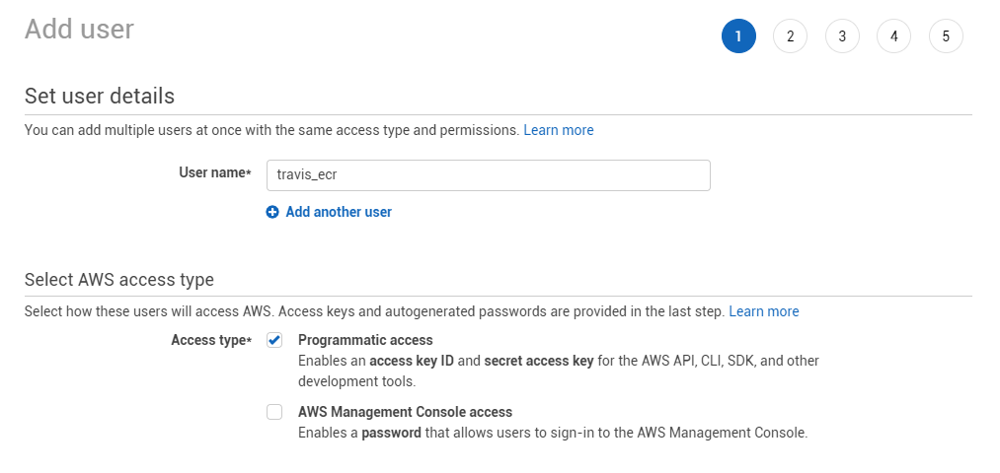
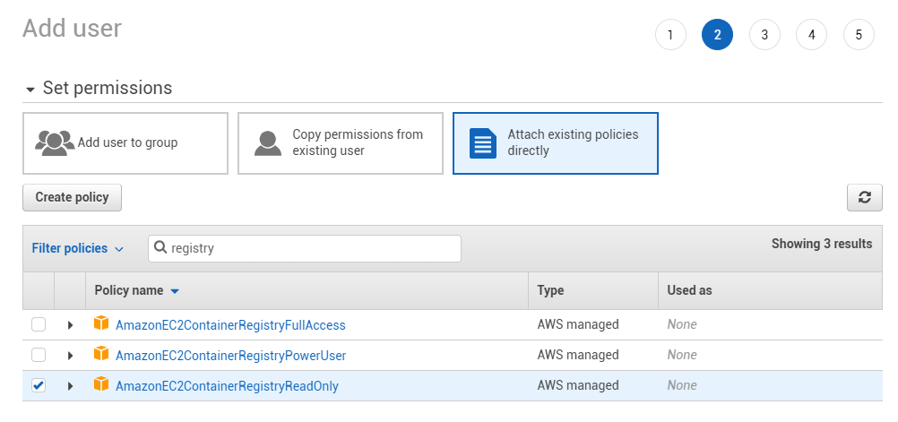
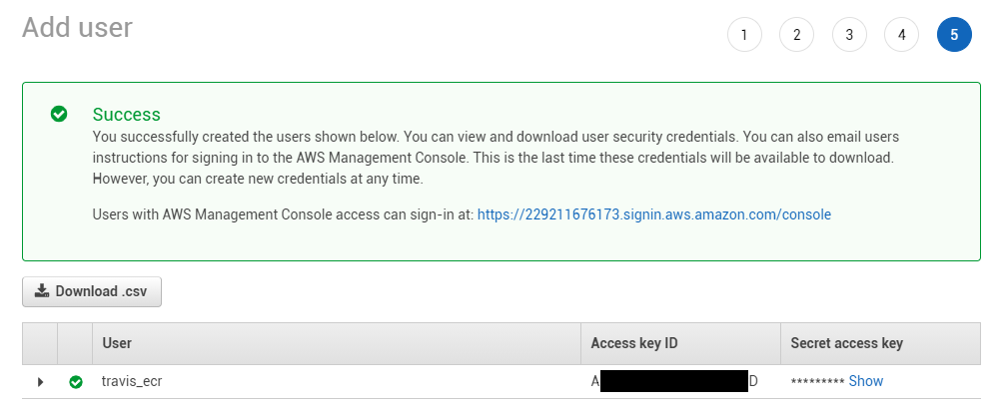

### ECR (Amazon Elastic Container Registry)


The ```ecr```registry lets you configure [ECR](https://aws.amazon.com/ecr/) integration.

#### Variables

| Env var                            | Description                   | Supported values                                                                                  | Default value |
| ---------------------------------- |:-----------------------------:|:-------------------------------------------------------------------------------------------------:|:-------------:| 
| `WUD_REGISTRY_ECR_REGION`          | A valid AWS Region Code       | [AWS Region list](https://docs.aws.amazon.com/general/latest/gr/rande.html#regional-endpoints)    |               |
| `WUD_REGISTRY_ECR_ACCESSKEYID`     | A valid AWS Access Key Id     | [Standard AWS Credentials](https://docs.aws.amazon.com/general/latest/gr/aws-sec-cred-types.html) |               |
| `WUD_REGISTRY_ECR_SECRETACCESSKEY` | A valid AWS Secret Access Key | [Standard AWS Credentials](https://docs.aws.amazon.com/general/latest/gr/aws-sec-cred-types.html) |               |

!> The AmazonEC2ContainerRegistryReadOnly Policy (or higher) must be attached to the AWS IAM User.

#### Examples

```bash
WUD_REGISTRY_ECR_ACCESSKEYID=xxx
WUD_REGISTRY_ECR_SECRETACCESSKEY=xxx
WUD_REGISTRY_ECR_REGION=eu-west-1
```

#### How to create an AWS IAM user and get programmatic access

##### 1. Login to your&nbsp;[Go to the IAM Service from your AWS Console](https://console.aws.amazon.com/iam) and create a new user


##### 2. Attach the AmazonEC2ContainerRegistryReadOnly policy to the user


##### 3. Get your AccessKeyId and your Secret Access Key and configure WUD with them

