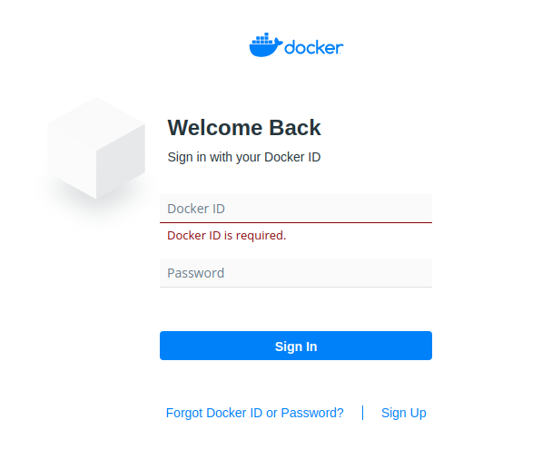

### HUB (Docker Hub incl private repositories)


The ```hub```registry lets you configure [Docker Hub](https://hub.docker.com/) integration.

Currently, the supported credentials are:
- Docker Hub login + Docker Hub Access Token
- Docker Base64 credentials (like in [.docker/config.json](https://docs.docker.com/engine/reference/commandline/login/))
- Docker Hub login + Docker Hub password (not recommended)

!> By default, if you don't configure any registries, WUD will configure a default one with anonymous access. \
Don't forget to configure authentication if you're using [Docker Hub Private Repositories](https://docs.docker.com/docker-hub/repos/#private-repositories).

#### Variables

| Env var                  | Description                                                               | Supported values                                  | Default value |
| ------------------------ |:-------------------------------------------------------------------------:|:-------------------------------------------------:|:-------------:| 
| `WUD_REGISTRY_HUB_LOGIN` | A valid Docker Hub Login                                                  | WUD_REGISTRY_HUB_TOKEN must be defined            |               |
| `WUD_REGISTRY_HUB_TOKEN` | A valid Docker Hub Token                                                  | WUD_REGISTRY_HUB_LOGIN must be defined            |               |
| `WUD_REGISTRY_HUB_AUTH`  | A valid Docker Hub Base64 Auth String (empty string for anonymous access) | WUD_REGISTRY_HUB_LOGIN/TOKEN  must not be defined |               |

#### Examples

##### Configure for anonymous access
```bash
WUD_REGISTRY_HUB_AUTH=""
```

##### Configure Authentication using Login/Token

###### 1. Login to your&nbsp;[Docker Hub Account](https://hub.docker.com/)


###### 2. Go to your&nbsp;[Security Settings](https://hub.docker.com/settings/security)
- Create a new Access Token
- Copy it and use it as the `WUD_REGISTRY_HUB_TOKEN` value


```bash
WUD_REGISTRY_HUB_LOGIN=mylogin
WUD_REGISTRY_HUB_TOKEN=fb4d5db9-e64d-3648-8846-74d0846e55de
```

##### Configure Authentication using Base64 encoded credentials

###### 1. Create an Access Token
[See above](registries/hub/?id=configure-authentication-using-logintoken)

###### 2. Encode with Base64
Concatenate `$login:$password` and [encode with Base64](https://www.base64encode.org/).

For example,
- if your login is `johndoe`
- and your password is `2c1bd872-efb6-4f3a-81aa-724518a0a592`
- the resulting encoded string would be `am9obmRvZToyYzFiZDg3Mi1lZmI2LTRmM2EtODFhYS03MjQ1MThhMGE1OTI=`

```bash
WUD_REGISTRY_HUB_AUTH=am9obmRvZToyYzFiZDg3Mi1lZmI2LTRmM2EtODFhYS03MjQ1MThhMGE1OTI=
```
