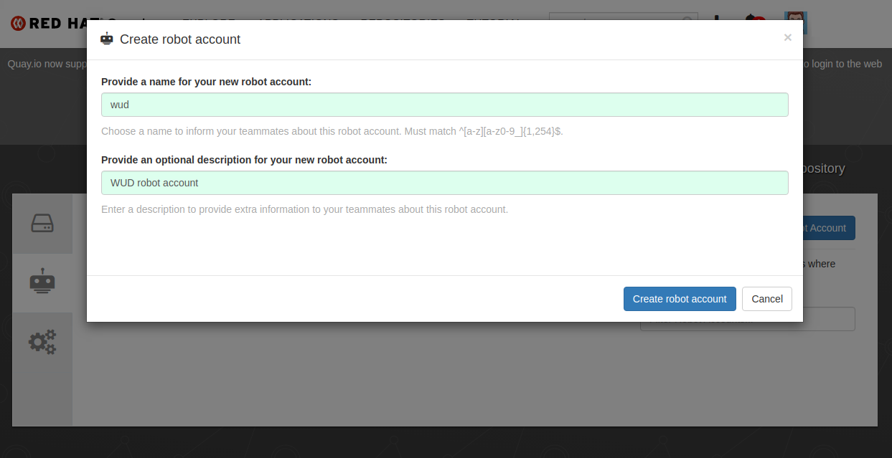
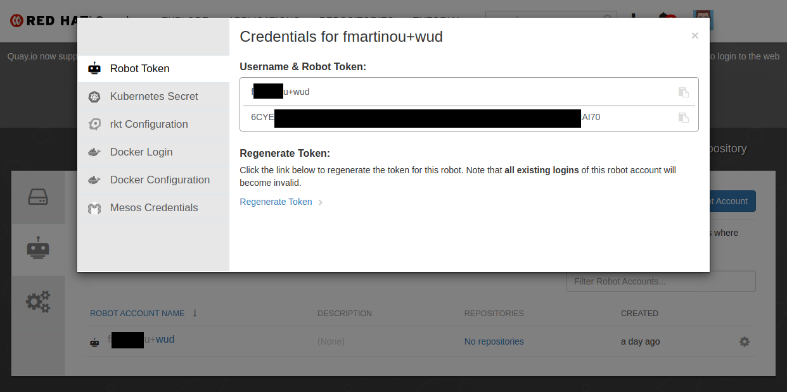

# Quay


The `quay` registry lets you configure [QUAY](https://quay.io/) integration.

### Variables

| Env var                      | Required        | Description    | Supported values | Default value when missing |
| ----------------------------- |:--------------:| -------------- | ---------------- | -------------------------- | 
| `WUD_REGISTRY_QUAY_NAMESPACE` | :white_circle: | Quay namespace |                  |                            |
| `WUD_REGISTRY_QUAY_ACCOUNT`   | :white_circle: | Quay account   |                  |                            |
| `WUD_REGISTRY_QUAY_TOKEN`     | :white_circle: | Quay token     |                  |                            |

### Examples

#### Configure to access public images (no credentials needed)

<!-- tabs:start -->
#### **Docker Compose**
```yaml
version: '3'

services:
  whatsupdocker:
    image: fmartinou/whats-up-docker
    ...
    environment:
      - WUD_REGISTRY_QUAY
```
#### **Docker**
```bash
docker run \
  -e WUD_REGISTRY_QUAY= \
  ...
  fmartinou/whats-up-docker
```
<!-- tabs:end -->

#### Configure to access private images (credentials needed)

<!-- tabs:start -->
#### **Docker Compose**
```yaml
version: '3'

services:
  whatsupdocker:
    image: fmartinou/whats-up-docker
    ...
    environment:
      - WUD_REGISTRY_QUAY_NAMESPACE=mynamespace
      - WUD_REGISTRY_QUAY_ACCOUNT=myaccount
      - WUD_REGISTRY_QUAY_TOKEN=BA8JI3Y2BWQDH849RYT3YD5J0J6CYEORYTQMMJK364B4P88VPTJIAI704L0BBP8D6CYE4P88V 
```
#### **Docker**
```bash
docker run \
  -e WUD_REGISTRY_QUAY_NAMESPACE="mynamespace" \
  -e WUD_REGISTRY_QUAY_ACCOUNT="myaccount" \
  -e WUD_REGISTRY_QUAY_TOKEN="BA8JI3Y2BWQDH849RYT3YD5J0J6CYEORYTQMMJK364B4P88VPTJIAI704L0BBP8D6CYE4P88V" \
  ...
  fmartinou/whats-up-docker
```
<!-- tabs:end -->

### How to create a Quay.io robot account
#### Go to your Quay.io settings and open the Robot Accounts tab

#### Click on `Create Robot Account`
Choose a name & create it


#### Copy the part before the `+` sign and set it as the `namespace` env var
#### Copy the part after  the `+` sign and set it as the `account` env var
#### Copy the token value and set it as the `token` env var

