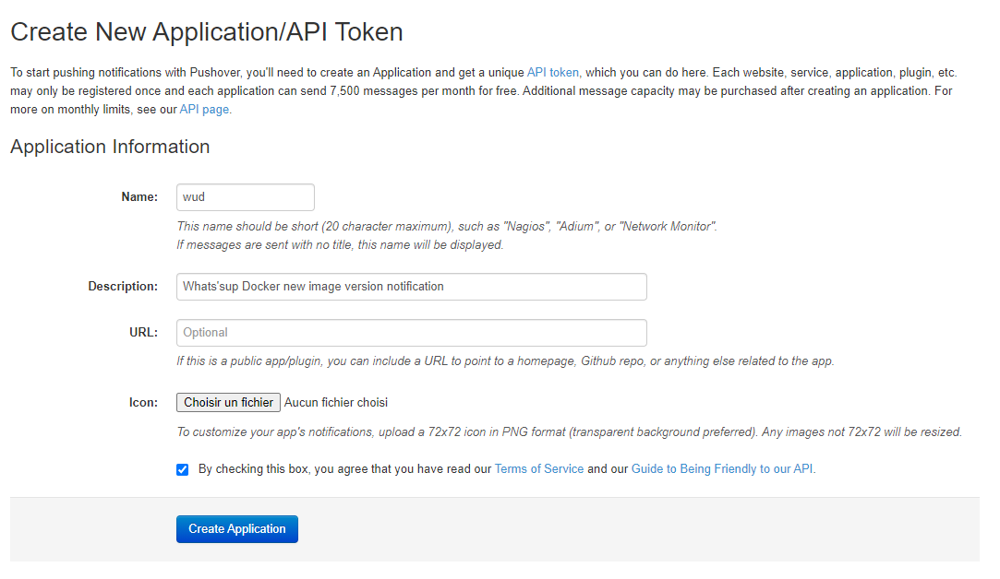
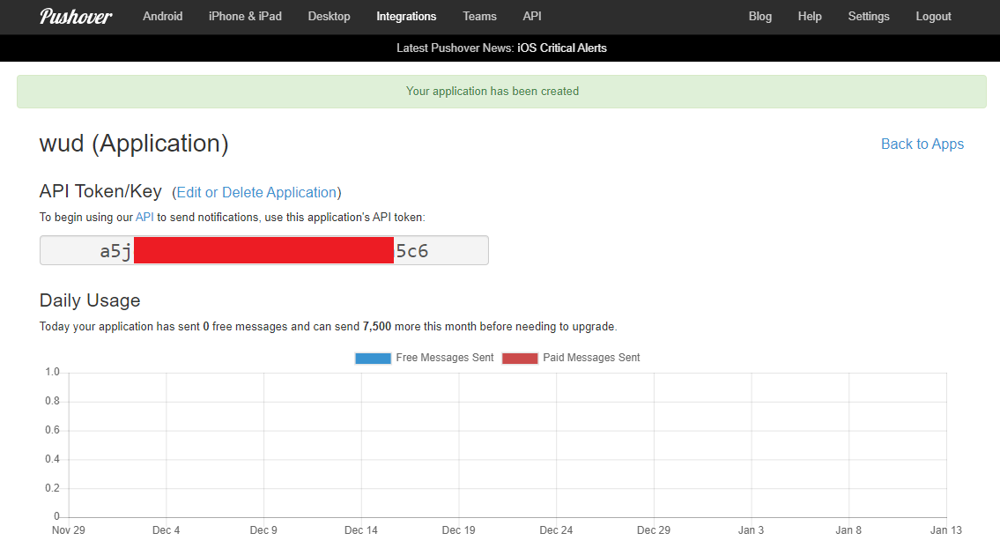

# Pushover


The `pushover` trigger lets you send realtime notifications to your devices (Android, iPhone...) using the [Pushover Service](https://pushover.net/).

### Variables

| Env var                                        | Required       | Description                                               | Supported values                                                                                   | Default value when missing  |
|------------------------------------------------|:--------------:|-----------------------------------------------------------| -------------------------------------------------------------------------------------------------- |-----------------------------| 
| `WUD_TRIGGER_PUSHOVER_{trigger_name}_TOKEN`    | :red_circle:   | The API token                                             |                                                                                                    |                             |
| `WUD_TRIGGER_PUSHOVER_{trigger_name}_USER`     | :red_circle:   | The User key                                              |                                                                                                    |                             |
| `WUD_TRIGGER_PUSHOVER_{trigger_name}_DEVICE`   | :white_circle: | The Device(s) to notify                                   | Coma separated list of devices (e.g. dev1,dev2) ([see here](https://pushover.net/api#identifiers)) |                             |
| `WUD_TRIGGER_PUSHOVER_{trigger_name}_SOUND`    | :white_circle: | The notification sound                                    | [see here](https://pushover.net/api#sounds)                                                        | `pushover`                  |
| `WUD_TRIGGER_PUSHOVER_{trigger_name}_PRIORITY` | :white_circle: | The notification priority                                 | [see here](https://pushover.net/api#priority)                                                      | `0`                         |
| `WUD_TRIGGER_PUSHOVER_{trigger_name}_EXPIRE`   | :white_circle: | The notification expire in seconds (only when priority=2) | [see here](https://pushover.net/api#priority)                                                      |                             |
| `WUD_TRIGGER_PUSHOVER_{trigger_name}_RETRY`    | :white_circle: | The notification retry in seconds (only when priority=2)  | [see here](https://pushover.net/api#priority)                                                      |                             |

?> This trigger also supports the [common configuration variables](configuration/triggers/?id=common-trigger-configuration).

### Examples

#### Configuration
##### Minimal
<!-- tabs:start -->
#### **Docker Compose**
```yaml
version: '3'

services:
  whatsupdocker:
    image: fmartinou/whats-up-docker
    ...
    environment:
      - WUD_TRIGGER_PUSHOVER_1_TOKEN=*****************************
      - WUD_TRIGGER_PUSHOVER_1_USER=******************************
```

#### **Docker**
```bash
docker run \
  -e WUD_TRIGGER_PUSHOVER_1_TOKEN="*****************************" \
  -e WUD_TRIGGER_PUSHOVER_1_USER="******************************" \
  ...
  fmartinou/whats-up-docker
```
<!-- tabs:end -->

##### Full
<!-- tabs:start -->
#### **Docker Compose**
```yaml
version: '3'

services:
  whatsupdocker:
    image: fmartinou/whats-up-docker
    ...
    environment:
        - WUD_TRIGGER_PUSHOVER_1_TOKEN=*****************************
        - WUD_TRIGGER_PUSHOVER_1_USER=******************************
        - WUD_TRIGGER_PUSHOVER_1_DEVICE=myIphone,mySamsung
        - WUD_TRIGGER_PUSHOVER_1_SOUND=cosmic
        - WUD_TRIGGER_PUSHOVER_1_PRIORITY=2
```

#### **Docker**
```bash
docker run \
    -e WUD_TRIGGER_PUSHOVER_1_TOKEN="*****************************" \
    -e WUD_TRIGGER_PUSHOVER_1_USER="******************************" \
    -e WUD_TRIGGER_PUSHOVER_1_DEVICE="myIphone,mySamsung" \
    -e WUD_TRIGGER_PUSHOVER_1_SOUND="cosmic" \
    -e WUD_TRIGGER_PUSHOVER_1_PRIORITY="2" \
  ...
  fmartinou/whats-up-docker
```
<!-- tabs:end -->

### How to get the User key
[Click here](https://pushover.net/settings)

The key is printed under the section `Reset User Key`.

### How to get an API token
#### Register a new application
[Click here](https://pushover.net/apps/build)



#### Copy the API token

