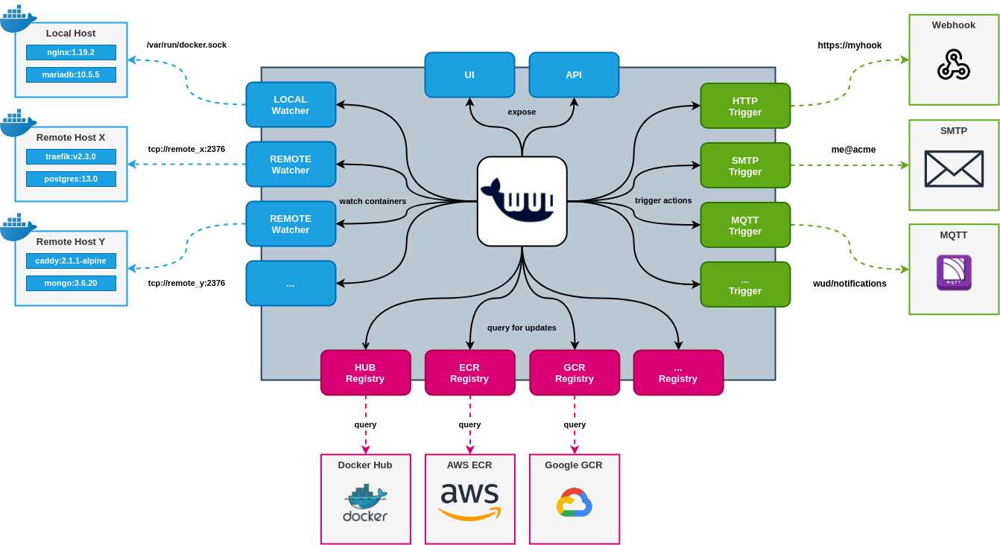

# Introduction

## What is that?
**What's up Docker** (aka _**WUD**_) gets you notified when a new version of your Docker Container is available.  

WUD is built on top of 3 concepts:
- **WATCHERS** query your Docker hosts to get the containers to watch
- **REGISTRIES** check whether updates are available
- **TRIGGERS** get you notified upon available updates

?> Ready to go? [Follow the quick start guide!](quickstart/)

## Contact & Support

- Create a [GitHub issue](https://github.com/fmartinou/whats-up-docker/issues) for bug reports, feature requests, or questions
- Add a ⭐️ [star on GitHub](https://github.com/fmartinou/whats-up-docker) to support the project!

## License

This project is licensed under the [MIT license](https://github.com/fmartinou/whats-up-docker/blob/master/LICENSE).

<!-- GitHub Buttons -->
