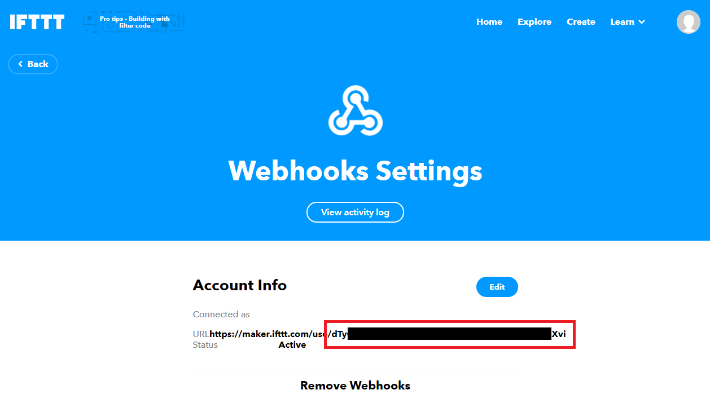
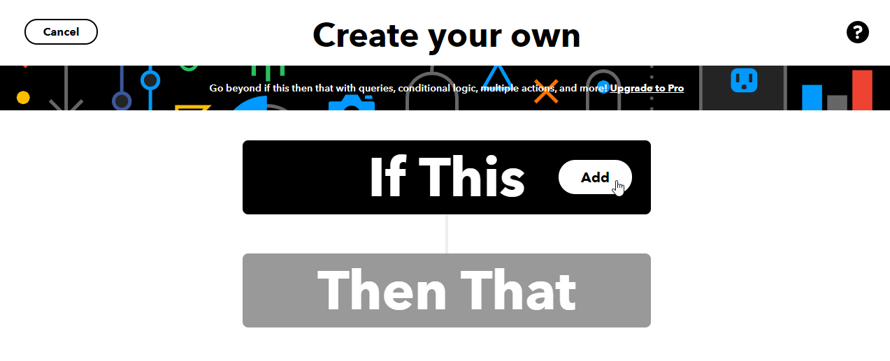
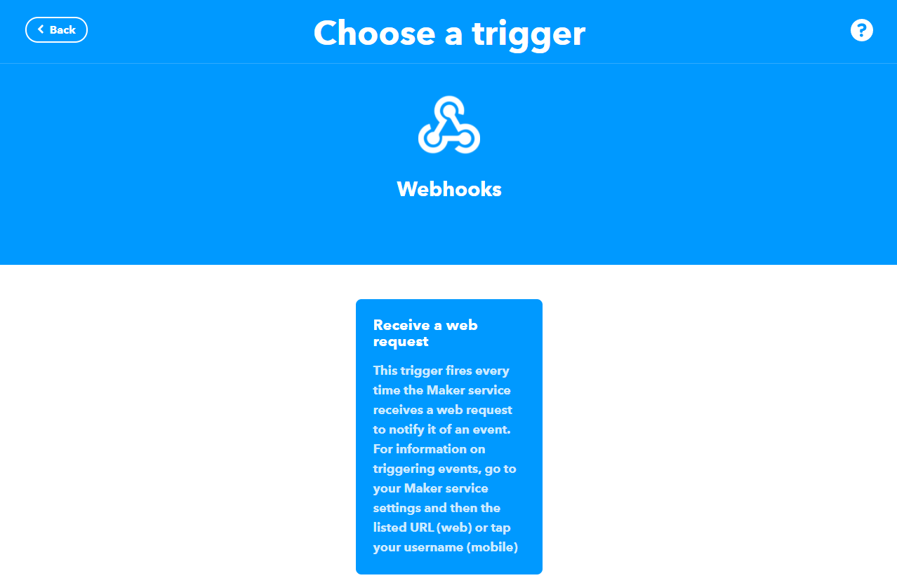
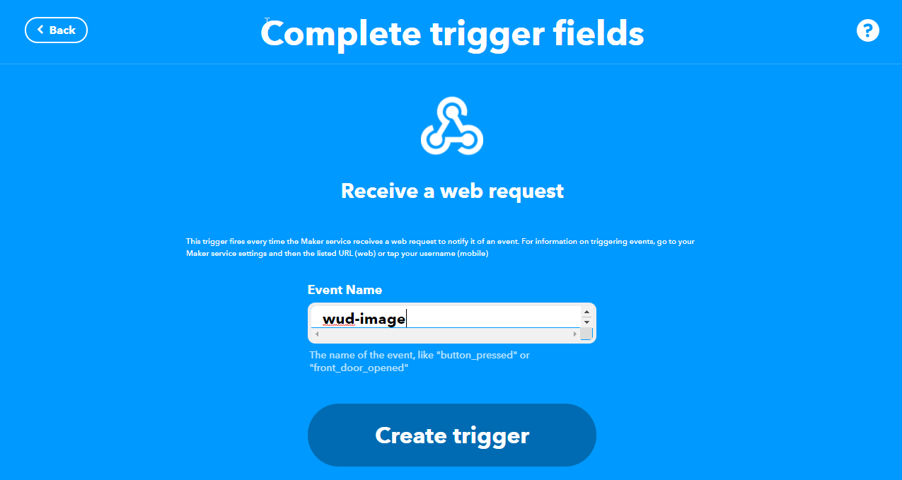
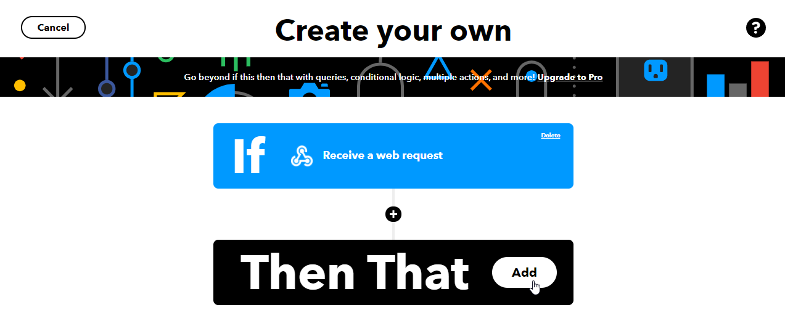

## Ifttt


The ```ifttt``` trigger lets you send image update notifications to Ifttt via the [Maker Webhook applet](https://ifttt.com/maker_webhooks/).

### Variables

| Env var                                      | Description     | Supported values | Default value |
| --------------- ---------------------------- |:---------------:|:----------------:|:-------------:| 
| ```WUD_TRIGGER_IFTTT_{trigger_name}_KEY```   | The Webhook key |                  |               |
| ```WUD_TRIGGER_IFTTT_{trigger_name}_EVENT``` | The event name  |                  | wud-image     |

### Ifttt ingredients
On Webhook call, Ifttt captures the following ingredients:
- eventName
- occuredAt
- value1 (the image which can be updated)
- value2 (the new version)
- value3 (the image notification JSON message)

### Examples

#### Configuration
```bash
WUD_TRIGGER_IFTTT_PROD_KEY="*******************************************"
```

#### Ifttt captured ingredients
- EventName: `wud-image`
- OccuredAt: `August 30, 2019 at 06:51PM`
- Value1: `https://hub.docker.com/library/mariadb`
- Value2: `10.5.4-focal`
- Value3: `{"watcher":"docker.local","registry":"hub","registryUrl":"https://registry-1.docker.io/v2","image":"library/nginx","version":"1.8-alpine","versionDate":"2016-04-05T19:06:30.86000223Z","architecture":"amd64","os":"linux","size":15474931,"includeTags":"^[0-9]\\d*\\.[0-9]\\d*-alpine$","isSemver":true,"result":{"newVersion":"1.19-alpine"}}`

### How to find the IFTTT key
#### Open the Webhook channel & Connect
[Click here](https://ifttt.com/maker_webhooks)

And click on `Connect`


#### Get the key from the settings
[Click here](https://ifttt.com/maker_webhooks/settings)

And copy the key from the URL


### How to create an IFTTT receipt
#### Create a new receipt & add a "this" trigger
[Click here to create a new receipt](https://ifttt.com/create)



#### Add the Webhook service


#### Select the 'Receive a web request' trigger


#### Enter the trigger event name (wud-image by default)


#### Define the 'then that' action


It's up to you :) Send an email...
