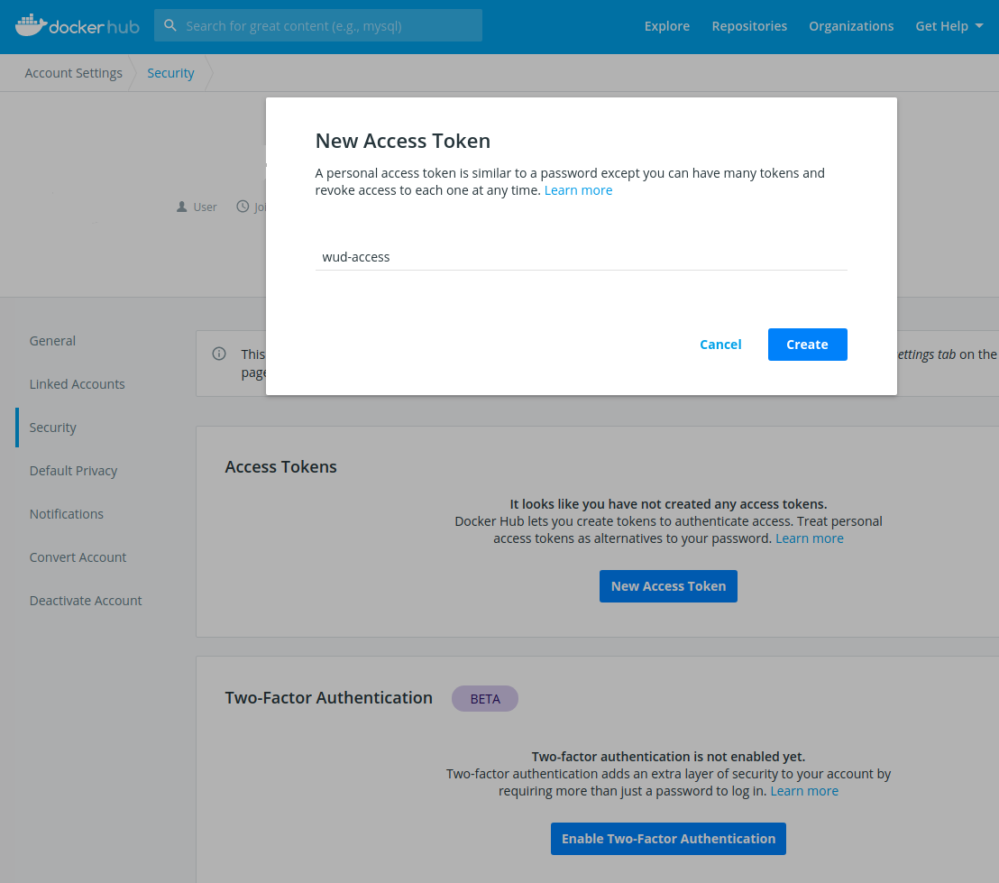

## Docker Hub Registry


The Docker watcher can find new versions of Images hosted on the [Docker Hub](https://hub.docker.com/).

### Variables

| Env var                                                          | Description                                    | Supported values | Default value |
| ---------------------------------------------------------------- |:----------------------------------------------:|:----------------:|:-------------:|
| `WUD_WATCHER_DOCKER_{watcher_name}_REGISTRIES_HUB_AUTH_LOGIN`    | Docker Login (for private repositories)        |                  |               |
| `WUD_WATCHER_DOCKER_{watcher_name}_REGISTRIES_HUB_AUTH_PASSWORD` | Docker Access Token (for private repositories) | Docker Token     |               |

### Examples

#### Configure Authentication on the default LOCAL Docker Watcher to access private repositories
```bash
"WUD_WATCHER_DOCKER_LOCAL_REGISTRIES_HUB_AUTH_LOGIN": "mysuperorganization",
"WUD_WATCHER_DOCKER_LOCAL_REGISTRIES_HUB_AUTH_PASSWORD": "fb4d5db9-e64d-3648-8846-74d0846e55de"
```

### How to create a Docker Hub Access Token?

#### 1. Login to your&nbsp;[Docker Hub Account](https://hub.docker.com/)


#### 1. Go to your&nbsp;[Security Settings](https://hub.docker.com/settings/security)
- Create a new Access Token
- Copy it and use it as the `WUD_WATCHER_DOCKER_{watcher_name}_REGISTRIES_HUB_AUTH_PASSWORD` value

